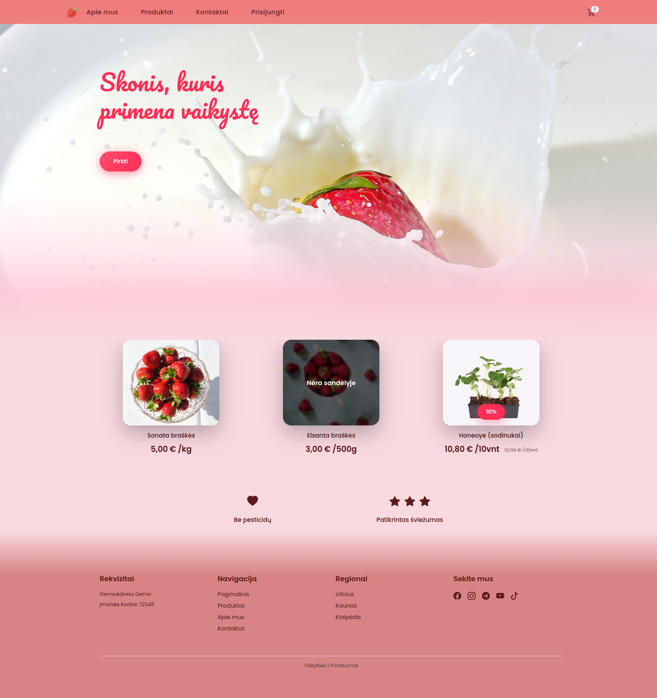
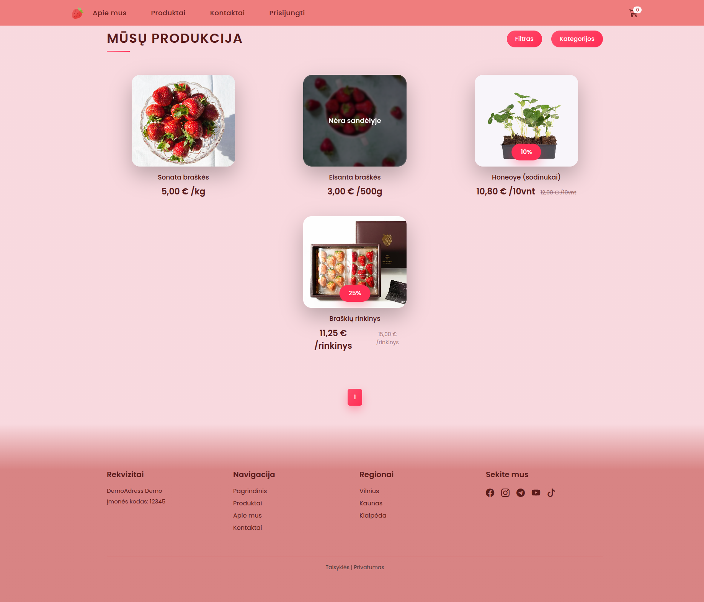
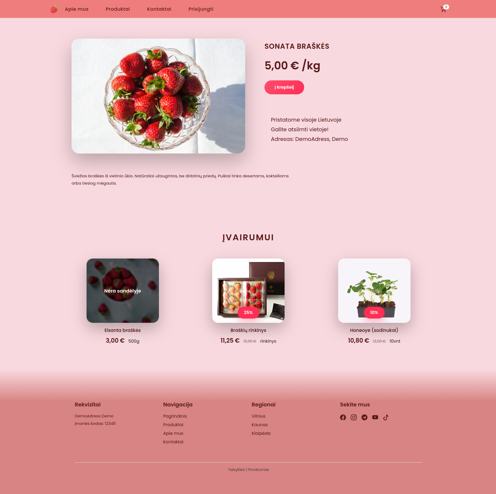
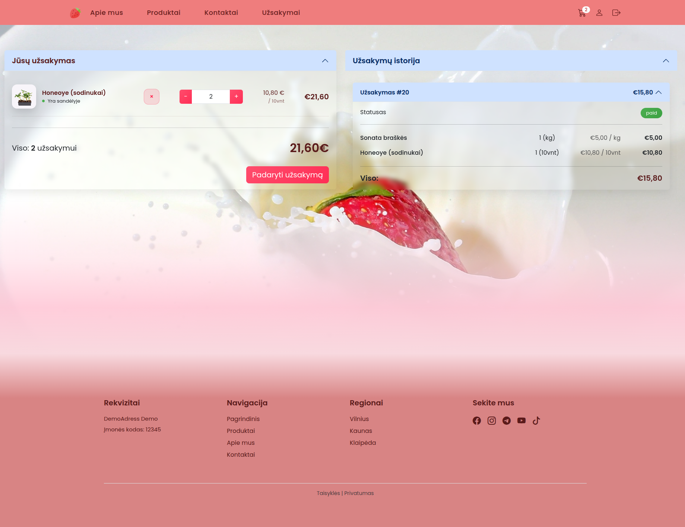
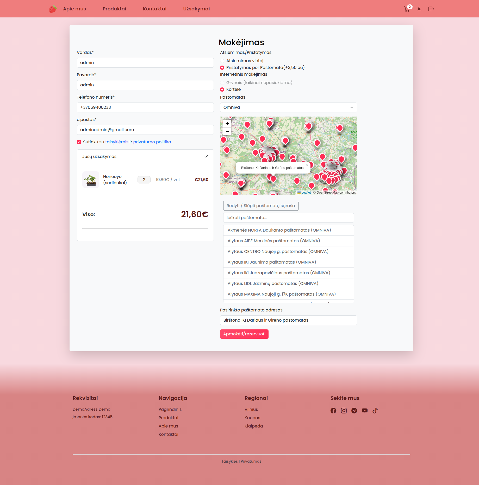
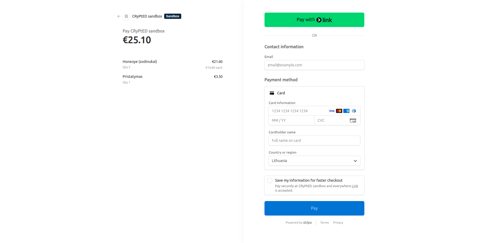
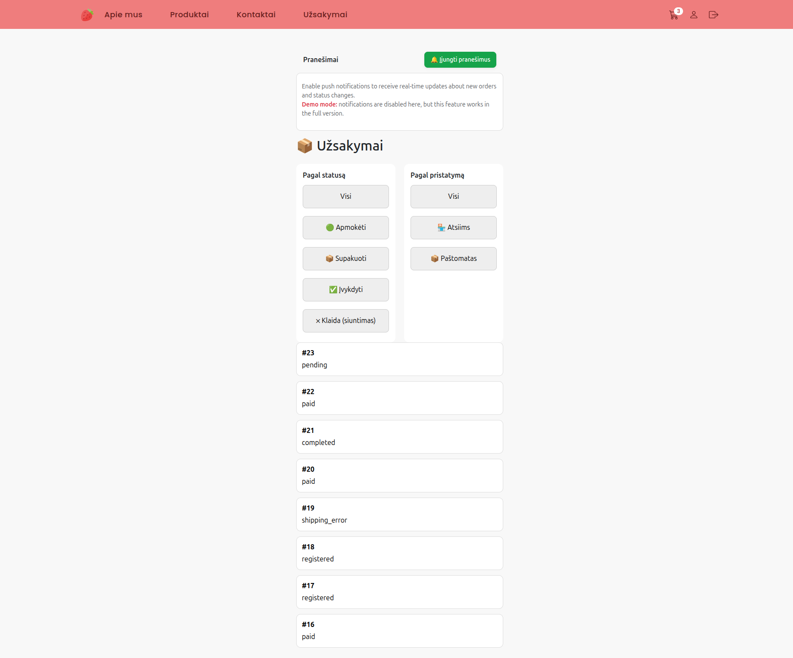
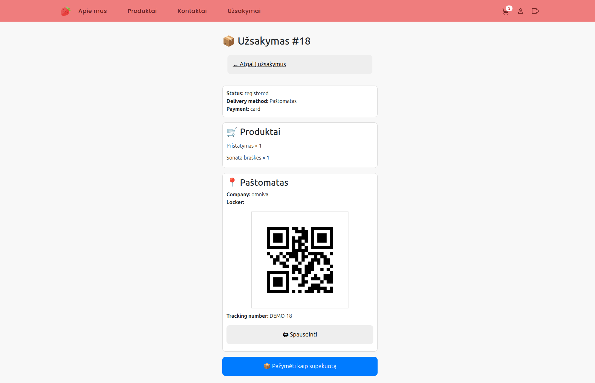

# 🍓 Strawberry E-commerce Platform

Production-ready e-commerce platform built with Django.
Originally developed for a real client use case and adapted into a public demo for portfolio purposes. The platform processed real orders in production.

---
## 🚀 Live Demo

https://django-ecommerce-platform-production.up.railway.app

---
## 📸 Screenshots

### Storefront




### Checkout & Payment




### Manager Dashboard




## 📦 Features

- Product catalog
- Shopping cart system
- Order management workflow
- Stripe payment integration
- Delivery API integration (Omniva, DPD)
- User authentication and profiles
- Email notifications
- Custom manager dashboard


## 📱 Manager Dashboard

Custom-built panel for managing orders (not Django admin).

- View and update order statuses
- Track payments and delivery info
- Designed for real usage scenarios
- Mobile-friendly interface
- Can be installed on mobile as a web app (PWA)


### 📲 Mobile Access

The manager panel supports installation as a mobile app (PWA), allowing quick access to orders directly from a phone.


## 🎯 What this project demonstrates

- Real-world e-commerce backend architecture
- Order lifecycle and status management
- Payment processing with Stripe (including failure handling)
- Integration with external delivery APIs
- Separation of concerns (cart, orders, payments, users)
- Scalable and maintainable code structure

Designed to simulate a real-world e-commerce system used in production.


## 🧱 Project Structure

- `cart/` – shopping cart logic
- `orders/` – order creation and lifecycle
- `payments/` – Stripe integration
- `products/` – product catalog
- `users/` – authentication and profiles
- `manager/` – custom order management panel
- `notifications/` – email notifications
  
---

## ⚠️ Demo Version

This public version runs in **demo mode**:

* Payments are simulated
* External APIs are partially disabled
* Push notifications may not function
* Some features are restricted intentionally

The full production version includes complete integrations.

---

## 🔐 Admin Panel (Demo)

👉 https://django-ecommerce-platform-production.up.railway.app/users/login/

### Login:
admin

### Password:
adminadmin12345

## 🧪 Tech Stack

* Python / Django
* SQLite (demo environment)
* PostgreSQL (production-ready architecture)
* Gunicorn
* Bootstrap
* JavaScript
* Stripe API
* Omniva / DPD APIs

---

## ⚙️ Setup

```bash
git clone <repo>
cd project
pip install -r requirements.txt
```

---

## 🔑 Environment

Create `.env` based on `.env.example`

---

## ▶️ Run locally

```bash
python manage.py migrate
python manage.py runserver
```

---

## 🚀 Production run

```bash
gunicorn backend.wsgi:application
```

---

## 📸 Demo

👉 https://django-ecommerce-platform-production.up.railway.app

---

## 📌 Notes

This project demonstrates a real-world backend architecture including:

* scalable order system
* payment handling logic
* delivery service integration
* environment-based configuration (demo vs production)

---

## 👨‍💻 Author

Edvin Zenevič – Backend Developer
